# Portage

**Continuous one-way sync between object stores, across clouds.**

<picture>
  <source media="(prefers-color-scheme: dark)" srcset="docs/assets/portage-vision-dark.svg">
  
</picture>

Portage keeps a destination bucket in step with a source bucket: every new or
changed file is copied, checksum-verified and recorded, driven by the source's
change events and backed by a reconciler that catches anything missed. It's
built for pipelines that run indefinitely at hundreds of GB/day.

> **Status: pre-release.** v0.1 syncs Azure Blob Storage → Amazon S3 /
> OCI Object Storage. More endpoints are on the [roadmap](#roadmap).

### Why not a cron job or a Lambda?
That's what most teams start with, and it breaks at volume: listings get
slower than the schedule, a crash means re-copying everything or skipping
files, lost events are never noticed, an out-of-order copy lets an older
version overwrite a newer one, and nobody knows how far behind it is.
Portage keeps a durable record of every file and version, reacts to events in
seconds, reconciles in the background, and exposes lag as a metric.

## How it works

<picture>
  <source media="(prefers-color-scheme: dark)" srcset="docs/assets/portage-how-it-works-dark.svg">
  
</picture>

## Guarantees
- **Newest version wins.** An older version never overwrites a newer one.
- **Checksum-verified.** Every part is checked by the destination on upload
  (Content-MD5). The SHA-256 of the full content is computed while streaming
  and kept in the file record, and sampled ranges are read back from the
  destination and compared. Objects small enough for a single upload also
  carry the hash as `portagesha256` metadata.
- **Safe to retry.** A crash mid-copy resumes the multipart upload; nothing is
  copied twice or skipped.
- **Deletes off by default.**

## Quickstart (local, 5 minutes)
Runs a pipeline from an Azure Blob emulator (Azurite) to an S3-compatible
emulator (SeaweedFS). Needs Docker and Go 1.26.

```sh
docker compose -f deploy/docker-compose.yml up -d --wait   # Postgres, Azurite, SeaweedFS
go run ./examples/quickstart                               # creates container + bucket, uploads samples
go run ./cmd/portage run -c examples/pipeline.yaml         # Ctrl-C to stop
```
In another terminal:
```sh
go run ./cmd/portage status -c examples/pipeline.yaml
curl -s localhost:9090/metrics | grep '^portage_'
```
Files under `incoming/` in the `source` container appear under `from-azure/`
in the `dest` bucket; `not-synced/` is outside the pipeline's prefix and
stays put. The engine resumes where it left off after a restart.

A Grafana dashboard for these metrics is in `deploy/grafana/`.

## Configuration
See [`examples/pipeline.yaml`](examples/pipeline.yaml), including the
commented real-cloud shape (Azure → OCI Object Storage). On Azure, route
Event Grid `BlobCreated`/`BlobDeleted` events to a Storage Queue
(`events.type: azure_queue`); no inbound endpoint is needed. A periodic
reconciler catches anything missed and performs the initial copy.

## Roadmap
Portage is early. Here's what's built and what's next; priorities follow what
users ask for, so [open an issue](https://github.com/sunny36/portage/issues)
if something here matters to you.

**v0.1 (now)**
- Azure Blob Storage as source; Amazon S3, OCI Object Storage and other
  S3-compatible stores as destination
- Event-driven sync (Event Grid → Storage Queue, or a webhook) plus a
  periodic reconciler for missed events and the initial copy
- Resumable parallel multipart transfer, per-part MD5 and SHA-256
  verification, newest-version-wins file record
- `portage run / status / validate`, Prometheus metrics, Grafana dashboard

**Next**
- `portage check` to test credentials, permissions and event delivery
  before the first sync
- Published benchmark from a 24-hour Azure → OCI soak; the design targets
  are p95 lag under 60 s for files under 1 GB and 500 GB/day per pipeline
- More sources: Amazon S3 (EventBridge), Google Cloud Storage (Pub/Sub),
  OCI Object Storage (OCI Events)
- SFTP as source and destination (polling, with a size-settle or `.done`
  rule so half-written files aren't picked up)
- Azure Blob Storage as destination
- Inventory-report reconciliation for very large buckets

**Later**
- Optional outbound-only agent for on-prem SFTP servers that can't accept
  inbound connections
- A hosted Portage with a web portal: one-click, least-privilege access
  grants to each cloud; workers in the source's region; alerts; and feeds
  between two companies that each connect their own storage

## Development
```sh
docker compose -f deploy/docker-compose.yml up -d --wait   # Postgres, Azurite, SeaweedFS
go test ./...                                              # unit tests
go test -tags integration ./...                            # against the emulators
```
Design decisions live in [docs/adr](docs/adr).

## License
Apache-2.0
